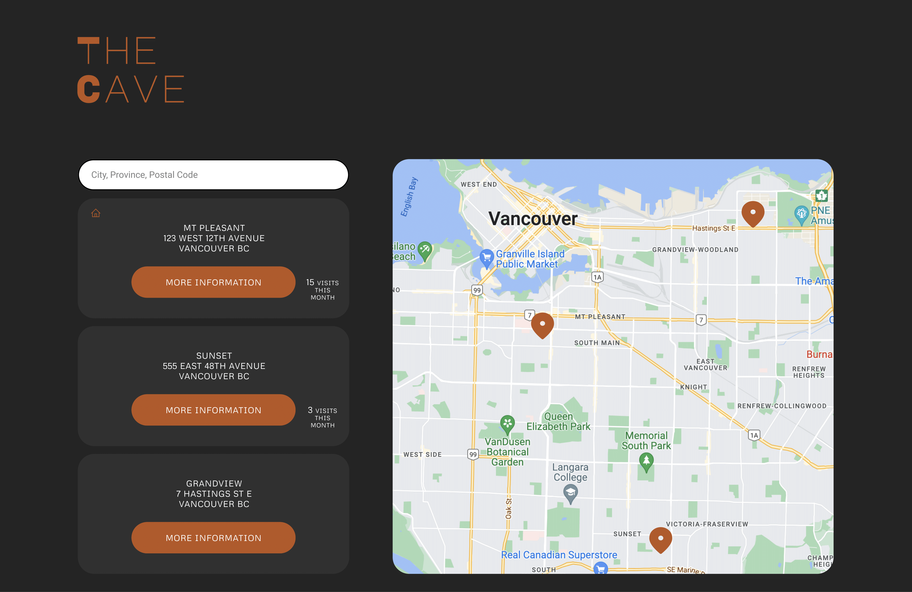
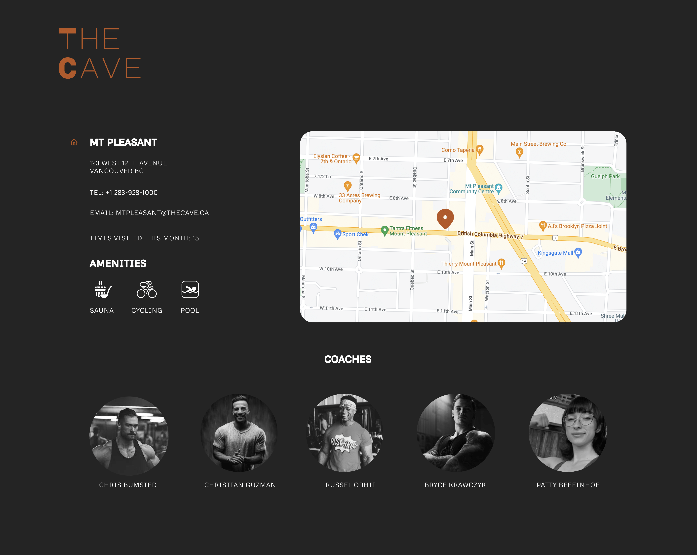
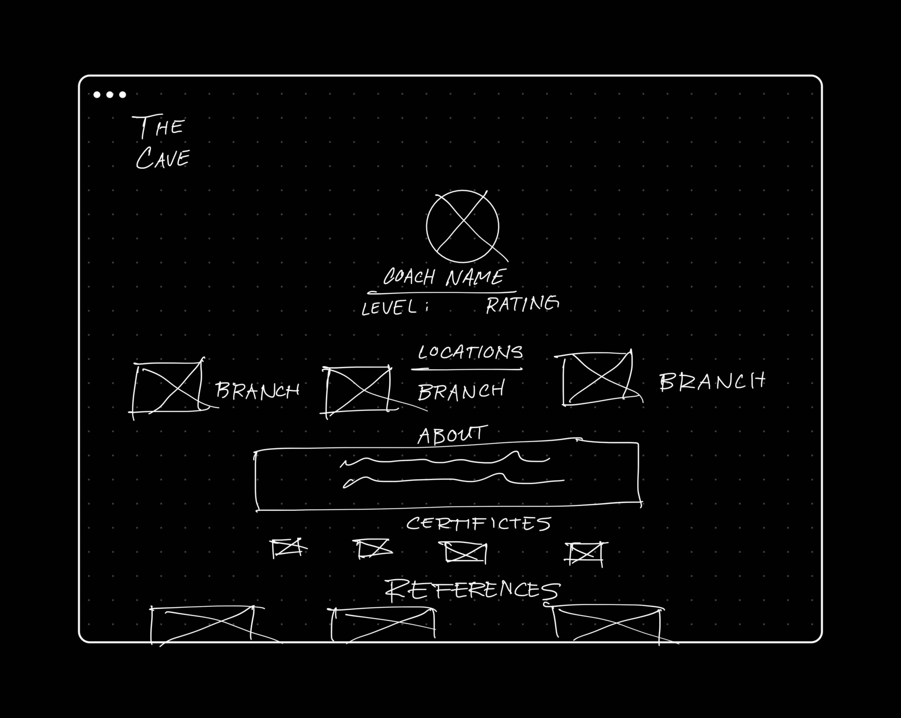
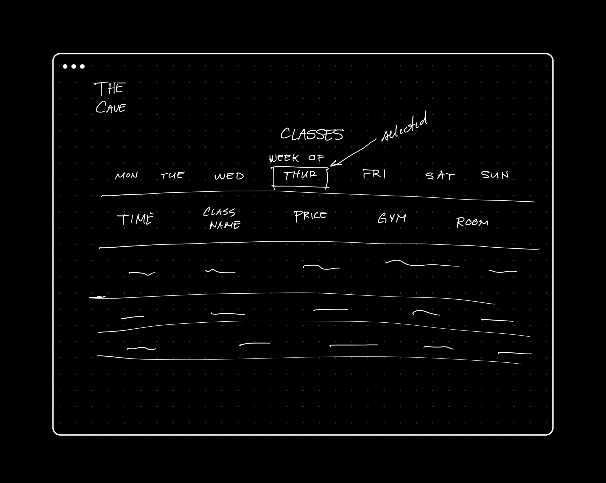
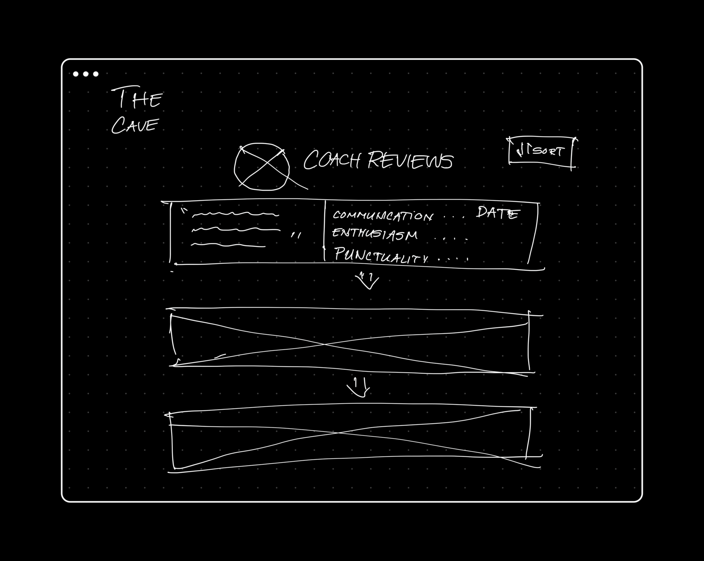
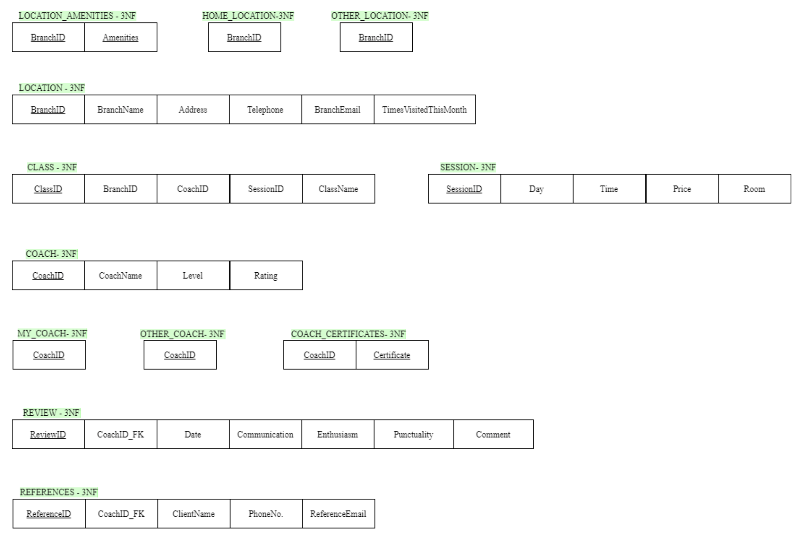
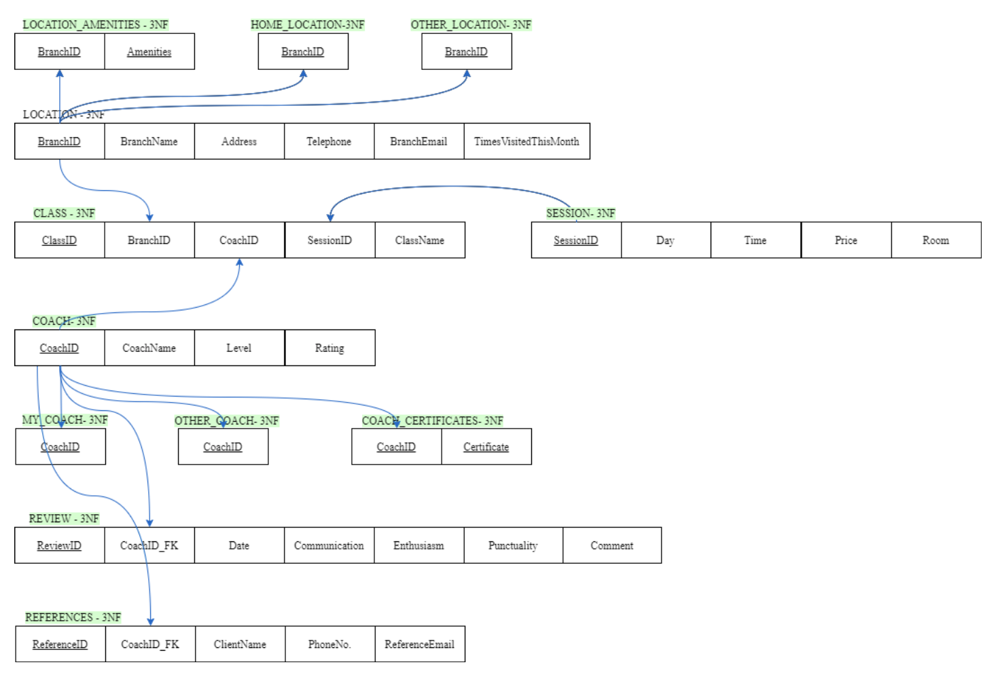

# 🏋🏽‍♀️ TheCave
A project showcasing a practical application of database design &amp; implementation along with some UX/UI design.

## Overview
The main goal of this project is to design and implement a database according to the wireframes shown in Figure 1.0. This will reflect the efficiency and representation of the communication of data in our information system. The following segments of this document will display the conceptual, logical models, and data structures, respectively. Once the diagrams have been iterated and revised, it will be implemented to our database management system. This is summarized in the figure1.1.







### Figure 1.0 - Mock and Draft Wireframes

### Figure 1.1 - Database Problem Solving Steps

| Page  | Notes |
| ------------- | ------------- |
| Locations | • #OfTimesVisitedThisMonth can be classified in a separate entity<br>• Home Location and Other Visited Location are each seen as a subtype to the Location Type – a location branch can either be your home location or other (cannot be both)  |
| Location Details  | • Address is assumed to be a single valued attribute<br>• Email attribute must be renamed into BranchEmail to avoid redundancy from Email attribute from Reference entity <br>• Each location branch represents a unique entity  |
| Coaches | •	Each coach represents a unique entity <br>•	My Coaches and Other Coaches are each seen as a subtype to Coach type – a coach can either be your coach or other (cannot be both) <br>• Coach Ratings and Reviews can be shown in another separate 
entity to avoid redundancy  |
| Coach Details | • References can be represented as a separate entity since it is a multivalued, composite attribute |
| Reviews | • Each review represents a unique entity<br>• Comment textboxes are each seen as a single valued attribute |
| Classes | • Since there is a many-to-many relationship between location and coach as well as session, this can be transformed into a ternary degree, associative relationship (class)|
### Table 1 -  Notes and Assumptions made for Designing Conceptual Model


### Figure 2 -  EER Diagram Derived from Wireframes


### Figure 3 -  Relational Schema in 3rd Normal Form
Figure 3 displays the 3rd Normal form for each relational schema derived from Figure 2. Because we have eliminated multivalued attributes, made surrogate key (ie. ClassID), and designed a well-refined EER Diagram, all the tables that shown in Figure 3 have little to no normalization methods applied.


### Figure 4 -  Data Structure Diagram

## Database Schema
```sql
-- Location_Amenties
CREATE TABLE Location_Amenities 
    (BranchID NUMBER(11,0) NOT NULL, 
    Amenities VARCHAR(25) NOT NULL,
CONSTRAINT LocationAmenities_PK PRIMARY KEY (BranchID, Amenities), 
CONSTRAINT BranchID_FK FOREIGN KEY (BranchID) REFERENCES Location(BranchID)
);

-- Home_Location
CREATE TABLE Home_Location
    (HLBranchID NUMBER(11,0) NOT NULL,
CONSTRAINT HLBranchID_FK FOREIGN KEY (HLBranchID) REFERENCES Location(BranchID)
);

-- Other_Location
CREATE TABLE Other_Location
    (OLBranchID NUMBER(11,0) NOT NULL,
CONSTRAINT OLBranchID_FK FOREIGN KEY (OLBranchID) REFERENCES Location(BranchID)
);

-- Location
CREATE TABLE Location
    (BranchID NUMBER(11,0) NOT NULL,
    BranchName VARCHAR(25,0) NOT NULL, Address VARCHAR(25,0),
    Telephone NUMBER(9,0),
    BranchEmail VARCHAR(25,0), TimesVisitedThisMonth NUMBER(2,0),
CONSTRAINT BranchID_PK PRIMARY KEY (BranchID) );

-- Class
CREATE TABLE Class
    (ClassID Number(11,0) NOT NULL, 
    BranchID Number(11,0) NOT NULL,
    CoachID Number(11,0) NOT NULL,
    SessionID Number(11,0) NOT NULL, 
    ClassName Number(11,0) NOT NULL,
CONSTRAINT ClassID_PK PRIMARY KEY (ClassID),
CONSTRAINT BranchID_FK FOREIGN KEY (BranchID) REFERENCES Location(BranchID),
CONSTRAINT CoachID_FK FOREIGN KEY (CoachID) REFERENCES Coach(CoachID),
CONSTRAINT SessionID_FK FOREIGN KEY (SessionID) REFERENCES Session(SessionID),
);

-- Session
CREATE TABLE Session
    (SessionID NUMBER(11,0) NOT NULL,
    Day VARCHAR(25,0),
    Time TIME,
    Price DECIMAL(19, 4), 
    Room VARCHAR(25,0),
CONSTRAINT SessionID_PK PRIMARY KEY (SessionID) );

-- Coach
CREATE TABLE Coach
    (CoachID NUMBER(11,0) NOT NULL,
    CoachName VARCHAR(25,0) , Level NUMBER(2,0),
    Rating NUMBER(2, 0),
CONSTRAINT CoachID_PK PRIMARY KEY (CoachID) );

-- My_Coach
CREATE TABLE My_Coach
    (MCCoachID NUMBER(11,0) NOT NULL,
CONSTRAINT MCCoachID_FK FOREIGN KEY (MCCoachID) REFERENCES Coach(CoachID)
);

-- Other_Coach
CREATE TABLE Other_Coach
    (OCCoachID NUMBER(11,0) NOT NULL,
CONSTRAINT OCCoachID_FK FOREIGN KEY (OCCoachID) REFERENCES Coach(CoachID)
);

-- Coach_Certificates
CREATE TABLE Coach_Certificates 
    (CoachID NUMBER(11,0) NOT NULL,
    Certificate VARCHAR(25) NOT NULL,
CONSTRAINT CoachCertificates_PK PRIMARY KEY (CoachID, Certificate), CONSTRAINT CoachID_FK FOREIGN KEY (CoachID) REFERENCES Coach(CoachID),
);

-- Review
CREATE TABLE Review
    (ReviewID NUMBER(11,0) NOT NULL,
    CoachID NUMBER(11,0) NOT NULL, Date DATE,
    Communication NUMBER(2,0), Enthusiasm NUMBER(2,0),
    Punctuality NUMBER(2,0),
    Comment VARCHAR(25),
CONSTRAINT ReviewID_PK PRIMARY KEY (ReviewID),
CONSTRAINT CoachID_FK FOREIGN KEY (CoachID) REFERENCES Coach(CoachID)
);

-- References 
CREATE TABLE Reference
    (ReferenceID NUMBER(11,0) NOT NULL,
    CoachID NUMBER(11,0) NOT NULL, ClientName VARCHAR(25),
    PhoneNo NUMBER(9,0), ReferenceEmail VARCHAR(25),
CONSTRAINT ReferenceID_PK PRIMARY KEY (ReferenceID),
CONSTRAINT CoachID_FK FOREIGN KEY (CoachID) REFERENCES Coach(CoachID)
);
```


## Room for improvement
* Database can be applied to a backend framework (ie. Node, Spring Boot) and a frontend (ie. Angular, React)
* Users/Authorization can be added for security(login/registration) purposes

## Technologies
* [MySQL](https://dev.mysql.com/doc/)
* [Figma](https://www.figma.com/)
* [Miro](https://www.miro.com/)
* [Draw.io](https://www.draw.io/)
