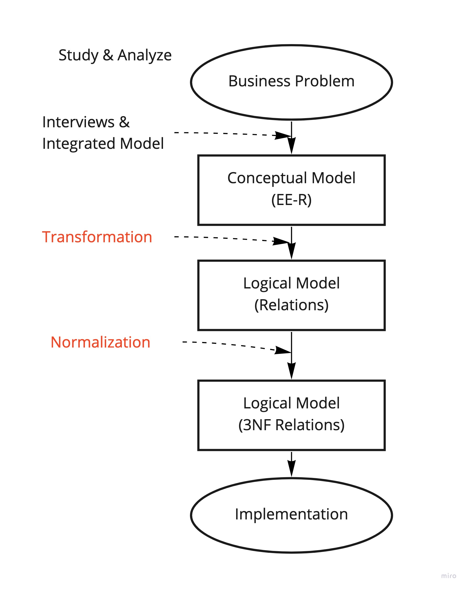
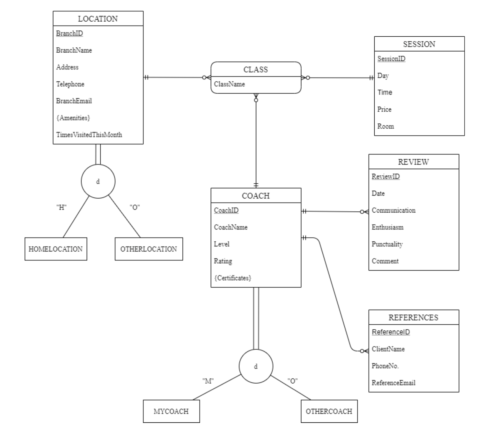

# 🏋🏽‍♀️ TheCave
A project showcasing a practical application of database design &amp; implementation along with some UX/UI design.

## Overview
The main goal of this project is to design and implement a database according to the wireframes shown in Figure 1.1. This will reflect the efficiency and representation of the communication of data in our information system. The following segments of this document will display the conceptual, logical models, and data structures, respectively. Once the diagrams have been iterated and revised, it will be implemented to our database management system. This is summarized in the diagram below:

### Figure 1.1 - Database Problem Solving Steps

### Figure 2 -  EER Diagram Derived from Wireframes

## Room for improvement
* Database can be applied to a backend framework (ie. Node, Spring Boot) and a frontend (ie. Angular, React)

## Technologies
* [MySQL](https://dev.mysql.com/doc/)
* [Figma](https://www.figma.com/)
